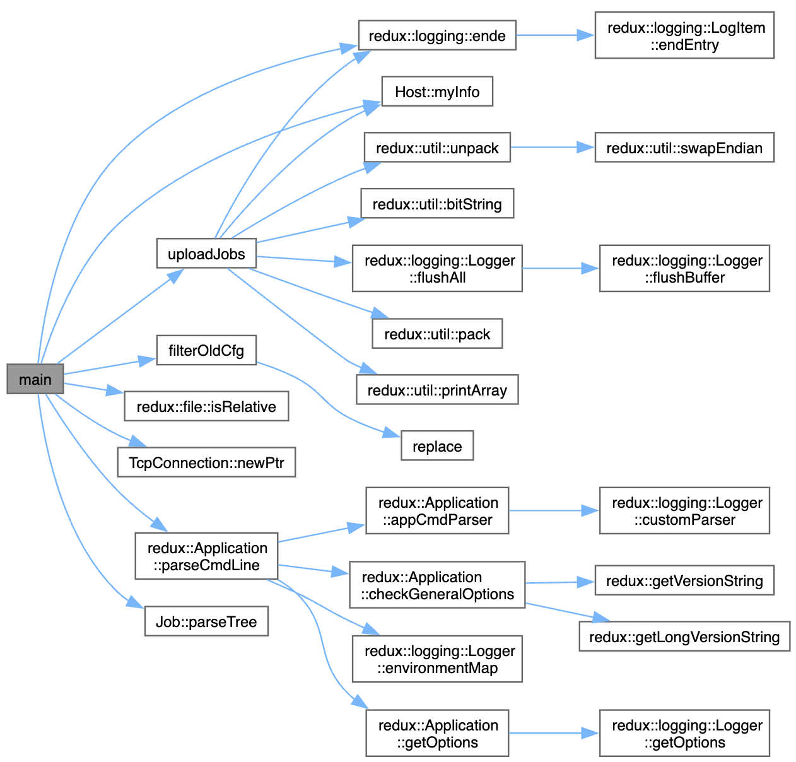
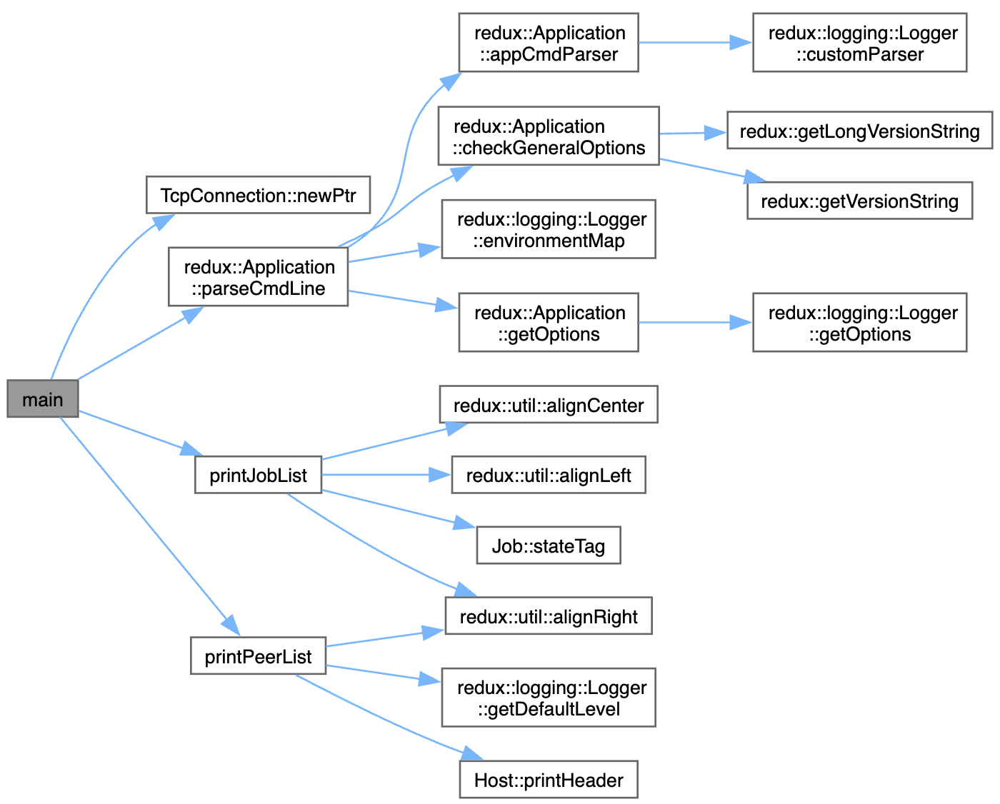
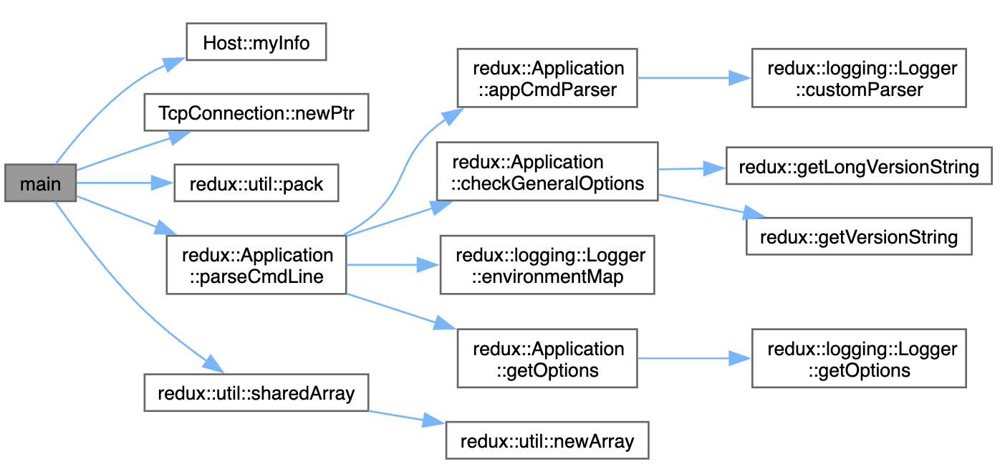
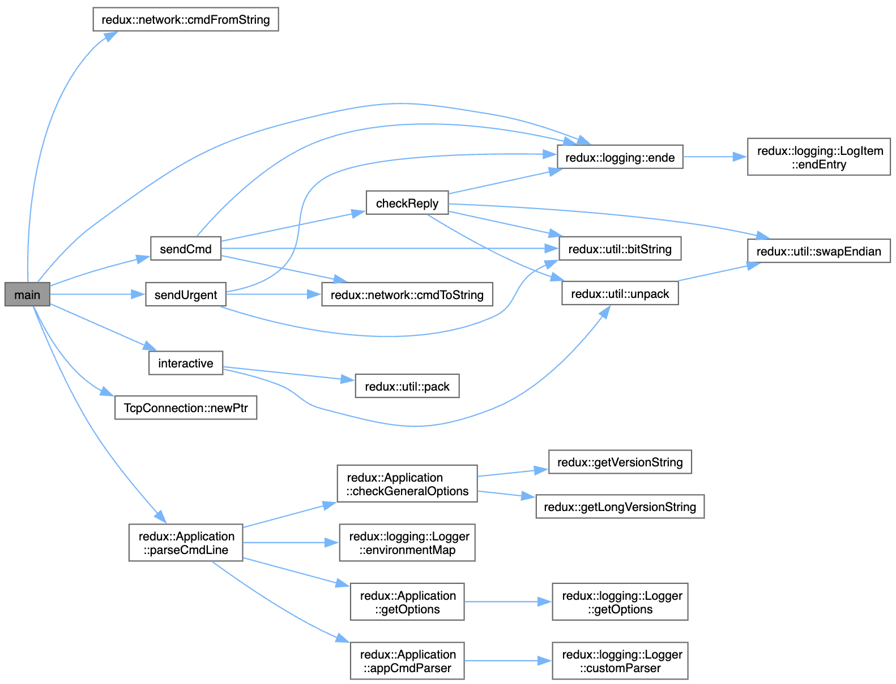

# Daily Progress Log

## Date: 08/07/2025

### Accomplishments
- [x] Trying with interactive terminal
    - salloc --job-name="test redux" --nodes=1 --ntasks=1 --time=01:00:00 --cpus-per-task=20 --partition=epyc2
    - srun --pty bash
    - To find a free port:
        - python -c 'import socket; s=socket.socket(); s.bind(("", 0)); print(s.getsockname()[1]); s.close()'

- [x] Trying this now -m ***HAS TO BE THE NODE NAME***:
```

ml Boost.MPI/1.76.0-gompi-2021a GSL/2.8-GCC-13.3.0 CFITSIO/4.4.1-GCCcore-13.3.0 FFTW.MPI/3.3.10-gompi-2023a zlib/1.2.11-GCCcore-10.3.0 CMake/3.29.3-GCCcore-13.3.0
ml Eigen/3.4.0-GCCcore-13.3.0

export LD_LIBRARY_PATH=$HOME/opt/opencv-install/lib:$LD_LIBRARY_PATH

/storage/homefs/jm25l251/apps-unibe/redux/build/src/bin/reduxd -p 60315 -C /storage/homefs/jm25l251/gregor-mfbd/raw_data -vvv -L -t 20 $SML_HOME/gregor-mfbd/momfbd/manager.log


/storage/homefs/jm25l251/apps-unibe/redux/build/src/bin/reduxd -m bnode006 -p 60315 -v -t 20

/storage/homefs/jm25l251/apps-unibe/redux/build/src/bin/rdx_sub --port 60315 -c /storage/homefs/jm25l251/gregor-mfbd/momfbd/gregor_F0010_M0060.cfg

/storage/homefs/jm25l251/apps-unibe/redux/build/src/bin/rdx_stat --port 60315 -j -s


```

- Update config!!!
    - IMAGE_DATA_DIR=/storage/homefs/jm25l251/gregor-mfbd/raw_data/
    - PUPIL=/storage/homefs/jm25l251/gregor-mfbd/raw_data/pupil.fz


## Date: 08/07/2025

### Accomplishments
- [x] Trying with interactive terminal
    - salloc --job-name="test redux" --nodes=1 --ntasks=1 --time=01:00:00 --cpus-per-task=20 --partition=epyc2
    - srun --pty bash

- [x] Trying to run redux on ubelix/slurm. Starting with single node:
```
#SBATCH --job-name="test redux"
#SBATCH --time=00:45:00
#SBATCH --partition=epyc2
##SBATCH --qos=job_icpu-aiub
##SBATCH --mem-per-cpu=2G
#SBATCH --ntasks=20
#SBATCH --cpus-per-task=1
##SBATCH --mail-user=
##SBATCH --mail-type=end,fail
#SBATCH --verbose
##SBATCH --nodes=1
##SBATCH --nodelist=bnode[001-011]
##SBATCH --exclude=bnode[001-028] # bnode002,bnode003,bnode004,bnode005,bnode006,bnode007,bnode008,bnode009,bnode010,bnode011
##Your code below this line
##HPC_WORKSPACE=aiub_sml_ws module load Workspace

ml Boost.MPI/1.76.0-gompi-2021a GSL/2.8-GCC-13.3.0 CFITSIO/4.4.1-GCCcore-13.3.0 FFTW.MPI/3.3.10-gompi-2023a zlib/1.2.11-GCCcore-10.3.0 CMake/3.29.3-GCCcore-13.3.0
ml Eigen/3.4.0-GCCcore-13.3.0

export LD_LIBRARY_PATH=$HOME/opt/opencv-install/lib:$LD_LIBRARY_PATH

# Start master
/storage/homefs/jm25l251/apps-unibe/redux/build/src/bin/reduxd -p 7801 -C /storage/homefs/jm25l251/gregor-mfbd/raw_data -vvv -L -t 20 $SML_HOME/gregor-mfbd/momfbd/manager.log

sleep 4

# Start workers
/storage/homefs/jm25l251/apps-unibe/redux/build/src/bin/reduxd -m sml -p 7801 -v -t 20

sleep 4

# Start a job
/storage/homefs/jm25l251/apps-unibe/redux/build/src/bin/rdx_sub --port 7801 -c /storage/homefs/jm25l251/gregor-mfbd/momfbd/gregor_F0010_M0060.cfg

sleep 4

# Check redux/jobs status
/storage/homefs/jm25l251/apps-unibe/redux/build/src/bin/rdx_stat --port 7801 -j

# Kill all jobs
##/storage/homefs/jm25l251/apps-unibe/redux/build/src/bin/rdx_del --port 7801 -k -s all


```

- Update config!!!
    - IMAGE_DATA_DIR=/storage/homefs/jm25l251/gregor-mfbd/raw_data/
    - PUPIL=/storage/homefs/jm25l251/gregor-mfbd/raw_data/pupil.fz

## Date: 07/07/2025

### Accomplishments

- [x] Trying to run redux on ubelix/slurm. Starting with single node ***DOES NOT WORK***:
```
#SBATCH --job-name="test redux"
#SBATCH --time=00:45:00
#SBATCH --partition=epyc2
##SBATCH --qos=job_icpu-aiub
##SBATCH --mem-per-cpu=2G
#SBATCH --ntasks=20
#SBATCH --cpus-per-task=1
##SBATCH --mail-user=
##SBATCH --mail-type=end,fail
#SBATCH --verbose
##SBATCH --nodes=1
##SBATCH --nodelist=bnode[001-011]
##SBATCH --exclude=bnode[001-028] # bnode002,bnode003,bnode004,bnode005,bnode006,bnode007,bnode008,bnode009,bnode010,bnode011
##Your code below this line
##HPC_WORKSPACE=aiub_sml_ws module load Workspace

ml Boost.MPI/1.76.0-gompi-2021a GSL/2.8-GCC-13.3.0 CFITSIO/4.4.1-GCCcore-13.3.0 FFTW.MPI/3.3.10-gompi-2023a zlib/1.2.11-GCCcore-10.3.0 CMake/3.29.3-GCCcore-13.3.0
ml Eigen/3.4.0-GCCcore-13.3.0

export LD_LIBRARY_PATH=$HOME/opt/opencv-install/lib:$LD_LIBRARY_PATH

# Start master
/storage/homefs/jm25l251/apps-unibe/redux/build/src/bin/reduxd -p 7801 -C /storage/homefs/jm25l251/gregor-mfbd/raw_data -vvv -L -t 20 $SML_HOME/gregor-mfbd/momfbd/manager.log

sleep 4

# Start workers
/storage/homefs/jm25l251/apps-unibe/redux/build/src/bin/reduxd -m sml -p 7801 -v -t 20

sleep 4

# Start a job
/storage/homefs/jm25l251/apps-unibe/redux/build/src/bin/rdx_sub --port 7801 -c /storage/homefs/jm25l251/gregor-mfbd/momfbd/gregor_F0010_M0060.cfg

sleep 4

# Check redux/jobs status
/storage/homefs/jm25l251/apps-unibe/redux/build/src/bin/rdx_stat --port 7801 -j

# Kill all jobs
##/storage/homefs/jm25l251/apps-unibe/redux/build/src/bin/rdx_del --port 7801 -k -s all


```

- Update config!!!
    - IMAGE_DATA_DIR=/storage/homefs/jm25l251/gregor-mfbd/raw_data/
    - PUPIL=/storage/homefs/jm25l251/gregor-mfbd/raw_data/pupil.fz
    
### Challenges

### Learnings
---

## Date: 04/07/2025

### Accomplishments
- [x] Installing redux on UBELIX
    
### Challenges

### Learnings
---

## Date: 22/05/2025

### Accomplishments
- [x] running redux on SML machine
    ```
    #######export SML_HOME=/sml/YOUR_FOLDER_UNDER_SLASH_SML

    # Start master
    $SML_HOME/redux-new/redux/build/src/bin/reduxd -p 7801 -C $SML_HOME/gregor-mfbd/raw_data -vvv -L -t 20 $SML_HOME/gregor-mfbd/momfbd/manager.log

    # Start workers
    $SML_HOME/redux-new/redux/build/src/bin/reduxd -m sml -p 7801 -v -t 20

    # Start a job
    $SML_HOME/redux-new/redux/build/src/bin/rdx_sub --port 7801 -c $SML_HOME/gregor-mfbd/momfbd/gregor_F0010_M0060.cfg

    # Check redux/jobs status
    $SML_HOME/redux-new/redux/build/src/bin/rdx_stat --port 7801 -j

    # Kill all jobs
    $SML_HOME/redux-new/redux/build/src/bin/rdx_del --port 7801 -k -s all

    ```
- [x] **Install redux SIMPLE**
    ```
    #######export SML_HOME=/sml/YOUR_FOLDER_UNDER_SLASH_SML
    cd $SML_HOME
    mkdir redux/build
    cd redux/build
    cmake ../
    make -j 6 
    ```

- [x] **With Local Libs Still Broken, Probably CFITSIO** Install redux on sml using old boost
    - FOR OpenCV
        ``` 
        #######export SML_HOME=/sml/YOUR_FOLDER_UNDER_SLASH_SML
        mkdir -p $SML_HOME/opt/opencv
        cd $SML_HOME/opt

        wget https://github.com/opencv/opencv/archive/4.5.5.tar.gz
        tar -xzf 4.5.5.tar.gz
        cd opencv-4.5.5

        mkdir build && cd build

        ml Boost.MPI/1.76.0-gompi-2021a GSL/2.8-GCC-13.3.0 CFITSIO/4.4.1-GCCcore-13.3.0 FFTW.MPI/3.3.10-gompi-2023a zlib/1.2.11-GCCcore-10.3.0 CMake/3.29.3-GCCcore-13.3.0
        ml Eigen/3.4.0-GCCcore-13.3.0

        cmake .. \
        -DCMAKE_BUILD_TYPE=Release \
        -DCMAKE_INSTALL_PREFIX=$SML_HOME/opt/opencv-install \
        -DBUILD_LIST=core,imgcodecs,imgproc,highgui,features2d,calib3d,video,photo,flann \
        -DBUILD_EXAMPLES=OFF \
        -DBUILD_TESTS=OFF \
        -DBUILD_PERF_TESTS=OFF \
        -DBUILD_opencv_python=OFF

        make -j 24
        make install
        ```
    - FOR CFITSIO
        ```
        cd $SML_HOME/opt
        wget https://heasarc.gsfc.nasa.gov/FTP/software/fitsio/c/cfitsio_latest.tar.gz
        tar -xzf cfitsio_latest.tar.gz
        cd cfitsio-4.6.2
        ./configure --prefix=$SML_HOME/opt/cfitsio-install
        make -j 24
        make install
        ```
    - FOR BOOST **Older than 1.78 to avoid issues**
        ```
        cd $SML_HOME/opt
        wget https://archives.boost.io/release/1.76.0/source/boost_1_76_0.tar.gz
        tar -xzf boost_1_76_0.tar.gz
        cd boost_1_76_0

        ./bootstrap.sh --prefix=$SML_HOME/opt/boost-install
        ./b2 install -j 4
        ```
    - FOR redux
        ```
        #Go to redux folder

        cd $SML_HOME/redux

        mkdir build && cd build

        export LD_LIBRARY_PATH=$SML_HOME/opt/boost-install/lib:$SML_HOME/opt/opencv-install/lib:$SML_HOME/opt/cfitsio-install/lib:$LD_LIBRARY_PATH

        export CPATH=$SML_HOME/opt/boost-install/include:$CPATH

        cmake .. \
        -DOpenCV_DIR=$SML_HOME/opt/opencv-install/lib/cmake/opencv4 \
        -DCMAKE_PREFIX_PATH="$SML_HOME/opt/opencv-install;$SML_HOME/opt/cfitsio-install;$SML_HOME/opt/boost-install" \
        -DCMAKE_INCLUDE_PATH="$SML_HOME/opt/cfitsio-install/include;$SML_HOME/opt/boost-install/include" \
        -DCMAKE_LIBRARY_PATH="$SML_HOME/opt/cfitsio-install/lib;$SML_HOME/opt/boost-install/lib" \
        -DBoost_NO_SYSTEM_PATHS=ON \
        -DBOOST_ROOT=$SML_HOME/opt/boost-install \
        -DBoost_DEBUG=ON

        make -j 8
        ```
    
### Challenges

### Learnings
- Check input test data at: https://sml.unige.ch/nextcloud/apps/files/?dir=/redux_testdata&fileid=20645#
- Check email with instructions / example.

---


## Date: 21/05/2025

### Accomplishments
- [x] Install redux on sml **OUTDATED MOVING EVERYTHING TO /SML FOLDER, DO NOT USE HOME**.
    - **DO NOT USE HOME UPDATES ABOVE**
    - On SML we need to also install OpenCV locally and also CFITSIO. Below goes a full step by step to install redux on SML:
    - FOR OpenCV
        ``` 
        mkdir -p $HOME/opt/opencv
        cd $HOME/opt

        wget https://github.com/opencv/opencv/archive/4.5.5.tar.gz
        tar -xzf 4.5.5.tar.gz
        cd opencv-4.5.5

        mkdir build && cd build

        ml Boost.MPI/1.76.0-gompi-2021a GSL/2.8-GCC-13.3.0 CFITSIO/4.4.1-GCCcore-13.3.0 FFTW.MPI/3.3.10-gompi-2023a zlib/1.2.11-GCCcore-10.3.0 CMake/3.29.3-GCCcore-13.3.0
        ml Eigen/3.4.0-GCCcore-13.3.0

        cmake .. \
        -DCMAKE_BUILD_TYPE=Release \
        -DCMAKE_INSTALL_PREFIX=$HOME/opt/opencv-install \
        -DBUILD_LIST=core,imgcodecs,imgproc,highgui,features2d,calib3d,video,photo,flann \
        -DBUILD_EXAMPLES=OFF \
        -DBUILD_TESTS=OFF \
        -DBUILD_PERF_TESTS=OFF \
        -DBUILD_opencv_python=OFF

        make -j 8
        make install
        ```
    - FOR CFITSIO
        ```
        cd $HOME/opt
        wget https://heasarc.gsfc.nasa.gov/FTP/software/fitsio/c/cfitsio_latest.tar.gz
        tar -xzf cfitsio_latest.tar.gz
        cd cfitsio
        ./configure --prefix=$HOME/opt/cfitsio-install
        make -j$(nproc)
        make install
        ```
    - FOR BOOST
        ```
        cd $HOME/opt
        wget https://archives.boost.io/release/1.88.0/source/boost_1_88_0.tar.gz
        tar -xzf boost_1_88_0.tar.gz
        cd boost_1_88_0

        ./bootstrap.sh --prefix=$HOME/opt/boost-install
        ./b2 install -j 16
        ```
    - FOR redux
        ```
        #Go to redux folder

        mkdir build && cd build

        export LD_LIBRARY_PATH=$HOME/opt/boost-install/lib:$HOME/opt/opencv-install/lib:$HOME/opt/cfitsio-install/lib:$LD_LIBRARY_PATH

        export CPATH=$HOME/opt/boost-install/include:$CPATH

        cmake .. \
        -DOpenCV_DIR=$HOME/opt/opencv-install/lib/cmake/opencv4 \
        -DCMAKE_PREFIX_PATH="$HOME/opt/opencv-install;$HOME/opt/cfitsio-install;$HOME/opt/boost-install" \
        -DCMAKE_INCLUDE_PATH="$HOME/opt/cfitsio-install/include;$HOME/opt/boost-install/include" \
        -DCMAKE_LIBRARY_PATH="$HOME/opt/cfitsio-install/lib;$HOME/opt/boost-install/lib" \
        -DBoost_NO_SYSTEM_PATHS=ON \
        -DBOOST_ROOT=$HOME/opt/boost-install \
        -DBoost_DEBUG=ON

        make -j 8
        ```

### Challenges (check branch redux-updated-boostLib)

**Branch with the modifications for redux with newer >> 1.7 boost version**
**https://github.com/jhmkorndorfer/redux/tree/redux-updated-boostLib**

- For sml I installed the newest boost library. This caused a problem where I had to update the code since some boost classes changed name in the meanwhile. Basically I needed to find eveywhere in the code where **io_service was used and substitue for io_context**. The code below should do it...
```
# FOR MAC
# update io_service to context
find ./ -type f \( -name "*.cpp" -o -name "*.hpp" -o -name "*.h" -o -name "*.cc" \) \
  -exec sed -i '' 's/boost::asio::io_service/boost::asio::io_context/g' {} \;

# update work class
find ./ -type f \( -name "*.cpp" -o -name "*.hpp" -o -name "*.h" \) \
  -exec sed -i '' 's#boost::asio::io_context::work#boost::asio::executor_work_guard<boost::asio::io_context::executor_type>#g' {} \;

# update work class
find ./ -type f \( -name "*.cpp" -o -name "*.hpp" -o -name "*.h" \) \
  -exec sed -i '' 's#new boost::asio::io_context::work#boost::asio::make_work_guard#g' {} \;

# update post class
find ./ -type f \( -name "*.cpp" -o -name "*.hpp" -o -name "*.h" \) \
  -exec sed -i '' 's/\([a-zA-Z_][a-zA-Z0-9_]*\)\.post[[:space:]]*(/boost::asio::post(\1, /g' {} \;

# update reset - restart
find ./ -type f \( -name "*.cpp" -o -name "*.hpp" -o -name "*.h" \) \
  -exec sed -i '' -E 's/\b(ioService|ioContext|ctx)\.reset\(/\1.restart(/g' {} \;
```
- Apart from this a lot of other changes were needed... Branch created to store the changes.

- How to run it?


### Learnings
- Check input test data at: https://sml.unige.ch/nextcloud/apps/files/?dir=/redux_testdata&fileid=20645#
- Check email with instructions / example.

---

## Date: 20/05/2025

### Accomplishments
- [x] Generate call graph at least starting from main function to have an idea of code paths...
    - redux has several main files each for different parts of the code that seem to have to be executed at the same time. 
        - redux Master main, **reduxd.cpp**
            
        - redux Worker main, **rsub.cpp**
            
        - redux Stat for checking run status, **rstat.cpp**
            
        - **rdel.cpp** not sure yet what it does
            
        - **rctl.cpp** not sure yet what it does
            

### Challenges
- How to run it?


### Learnings
- Check input test data at: https://sml.unige.ch/nextcloud/apps/files/?dir=/redux_testdata&fileid=20645#
- Check email with instructions / example.

---


## Date: 19/05/2025

### Accomplishments
- [x] Install redux on UBELIX
    - Steps to achieve that again:
        - Before compiling redux on UBELIX we need to install **OpenCV**:
            ``` 
            mkdir -p $HOME/opt/opencv
            cd $HOME/opt

            wget https://github.com/opencv/opencv/archive/4.5.5.tar.gz
            tar -xzf 4.5.5.tar.gz
            cd opencv-4.5.5

            mkdir build && cd build

            ml Boost.MPI/1.76.0-gompi-2021a GSL/2.8-GCC-13.3.0 CFITSIO/4.4.1-GCCcore-13.3.0 FFTW.MPI/3.3.10-gompi-2023a zlib/1.2.11-GCCcore-10.3.0 CMake/3.29.3-GCCcore-13.3.0
            ml Eigen/3.4.0-GCCcore-13.3.0

            cmake .. \
            -DCMAKE_BUILD_TYPE=Release \
            -DCMAKE_INSTALL_PREFIX=$HOME/opt/opencv-install \
            -DBUILD_LIST=core,imgcodecs,imgproc,highgui,features2d,calib3d,video,photo,flann \
            -DBUILD_EXAMPLES=OFF \
            -DBUILD_TESTS=OFF \
            -DBUILD_PERF_TESTS=OFF \
            -DBUILD_opencv_python=OFF

            make -j 8
            make install
            ```
        - Now for **redux** we need to load all modules (same as above) and indicate to CMAKE where is OpenCV installed locally.
            ```
            # Inside redux folder create a build directory:
            mkdir build && cd build

            # cmake and indicate the location of OpenCV locally. The following should work everywhere...
            # Lets inform our system of another location for shared libraries
            export LD_LIBRARY_PATH=$HOME/opt/opencv-install/lib:$LD_LIBRARY_PATH
            # Lets inform CMake where to find OpenCV’s config file
            cmake .. \
                -DOpenCV_DIR=$HOME/opt/opencv-install/lib/cmake/opencv4 \
                -DCMAKE_PREFIX_PATH=$HOME/opt/opencv-install
            make -j 8

            ```

 
### Challenges
- How to run it?

### Learnings
- 

---

## Date: 16/05/2025

### Accomplishments
- [] Install redux on UBELIX


### Challenges
- Figure it out which modules on UBELIX will Fulfill the dependencies of redux.
    - 1st try using module avail to check where I can find the dependencies:
        - module avail boost
        - module avail gsl
        - module avail opencv
        - module avail cfitsio
        - module avail fftw
        - module avail zlib
            - Lets try to following modules:
                - ml Boost.MPI/1.76.0-gompi-2021a
                - ml GSL/2.8-GCC-13.3.0
                - opencv NOT FOUND YET, lets see what happens...
                - ml CFITSIO/4.4.1-GCCcore-13.3.0
                - ml FFTW.MPI/3.3.10-gompi-2023a  (using the same as we used for stic)
                - ml zlib/1.2.11-GCCcore-10.3.0
                - Make it easy for copy pasta:
                    - ml Boost.MPI/1.76.0-gompi-2021a GSL/2.8-GCC-13.3.0 CFITSIO/4.4.1-GCCcore-13.3.0 FFTW.MPI/3.3.10-gompi-2023a zlib/1.2.11-GCCcore-10.3.0 CMake/3.29.3-GCCcore-13.3.0 Eigen/3.4.0-GCCcore-13.3.0
- Installing opencv using the easybuild 'local' module is only crashing with different versions etc. I think I will end up having to install it locally.

### Learnings
- 


## Date: 15/05/2025

### Accomplishments
- [] Install OpenCV module on UBELIX
- [] Install redux on UBELIX
- [] Trying to install opencv using these instructions: https://hpc-unibe-ch.github.io/software/installing/easybuild/. This will allow us to have it as a 'local' easybuild module. 


### Challenges
- Still working on installing OpenCV on UBELIX as a local module. It always crashes somewhere but I cannot get the error... trying different versions of the OpenCV module now.

### Learnings
- Check WiKi shared by Lucia: https://dubshen.astro.su.se/wiki/index.php/Redux

---

## Date: 15/05/2025

### Accomplishments
- [] Install redux on UBELIX
- [] Trying to install opencv using these instructions: https://hpc-unibe-ch.github.io/software/installing/easybuild/. This will allow us to have it as a 'local' easybuild module. 


### Challenges
- Figure it out which modules on UBELIX will Fulfill the dependencies of redux.
    - 1st try using module avail to check where I can find the dependencies:
        - module avail boost
        - module avail gsl
        - module avail opencv
        - module avail cfitsio
        - module avail fftw
        - module avail zlib
            - Lets try to following modules:
                - ml Boost.MPI/1.76.0-gompi-2021a
                - ml GSL/2.8-GCC-13.3.0
                - opencv NOT FOUND YET, lets see what happens...
                - ml CFITSIO/4.4.1-GCCcore-13.3.0
                - ml FFTW.MPI/3.3.10-gompi-2023a  (using the same as we used for stic)
                - ml zlib/1.2.11-GCCcore-10.3.0
                - Also need to load CMake. Trying the newest available: ml CMake/3.29.3-GCCcore-13.3.0
- Installing opencv using the easybuild 'local' module is only crashing with different versions etc. I think I will end up having to install it locally.

### Learnings
- 

---

## Date: 12/05/2025

### Accomplishments
- [x] Task 1: Forking repository.
- [x] Task 2: Copy everything to UBELIX sever.
- [x] Task 3: Copy everything to miniHPC sever.


### Challenges
- NA

### Learnings
- NA

---